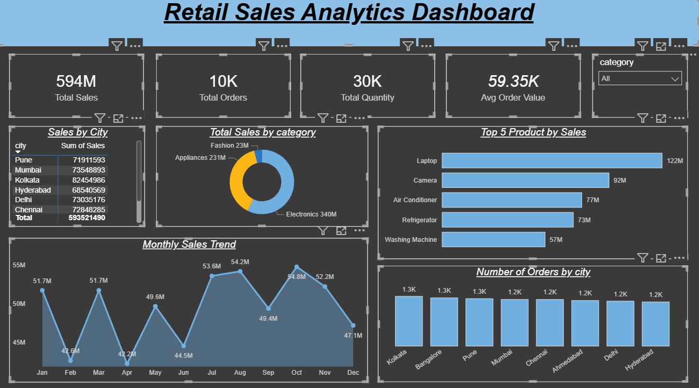

# Retail Sales Analytics Dashboard

## Project Overview
This project analyzes retail sales data and presents insights through an interactive Power BI dashboard.

## Tools Used
- Power BI
- Data Visualization
- Data Analysis

## Dashboard Features
- Total Sales
- Total Orders
- Total Quantity
- Average Order Value
- Sales Trend by Month
- Sales by Category
- Sales by City
- Top 5 Products by Sales

## Dataset
Retail sales dataset used for sales analysis and dashboard development.

## Dashboard Preview

